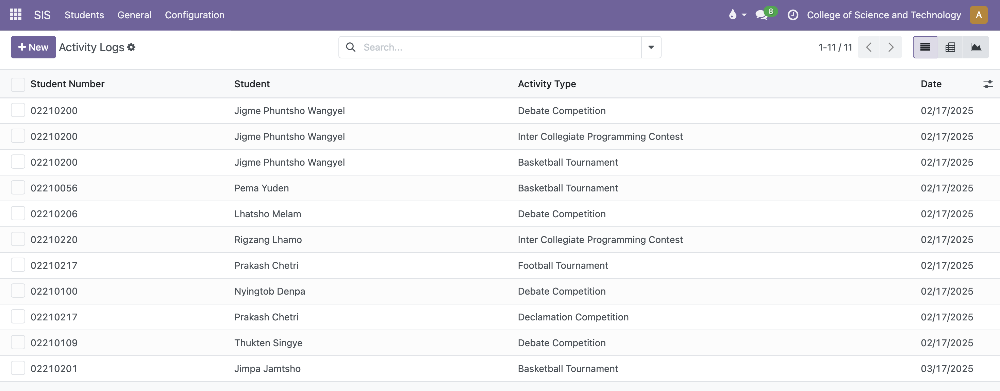

# CST-IMS (College of Science and Technology - Information Management System)

CST-IMS is a fully customized Information Management System developed using **Odoo 18** to streamline academic and administrative operations at the College of Science and Technology. This integrated system automates and digitizes core processes, enhancing efficiency and accuracy across departments.

---

## Features

CST-IMS includes **seven integrated modules**:

- **Student Information System**: Manage student personal and academic details.
- **Student Leave System**: Facilitate student leave applications and approvals.
- **Employee Management**: Handle staff profiles and employment data.
- **Employee Time-Off**: Manage employee leave requests and tracking.
- **Academic Management System**: Organize course, and manage module details.
- **Exams Module**: Manage exam grading, results processing, re-check and re-evaluation registration.
- **Semester Registration**: Streamline student semester enrollment and fee payment processing.

---

## Screenshots

### Dashboard

  
_Dashoboard you see after modules are installed_

### Student Information System

  
_Kanban view of student page_

  
_Individual Student Page_

  
_Student Activity Page_

  
_Student Achievment Page_

  
_Student Leadership Page_

  
_Student Disciplinary Incident Page_

### Student Leave System

  
_Student Leave Record page_

  
_Student Leave Individual page_

  
_Student New Leave Type Definition page_

### Employee

  
_Student Information Page_

  
_Department Management Page_

### Time Off

  
_Staff Leave Dashboard_

  
_Staff Leave Management Page_

### Academic Management

  
_Course Management_

  
_Module Management_

### Exams

  
_Marksheet Management_

  
_Upload Marks_


  
_Declare Results Marks_

### Semester Registration

  
  
_Registration Management_

  
  
_Handle Fee Structure_


_Handle Invoice Results_

---

## Prerequisites

Before installing and running CST-IMS, ensure you have the following installed and configured:

- **Odoo 18** (the system is specifically designed for this version)
- **Python 3.8+**
- PostgreSQL database server (recommended version 13+)
- Required Python dependencies (install via `pip install -r requirements.txt`)
- Access to the College’s network and appropriate permissions to deploy the system

---

## Installation and Setup

1. Clone the repository:

   ```bash
   git clone https://github.com/your-username/cst-ims.git
   ```

2. Install the modules via Odoo18
